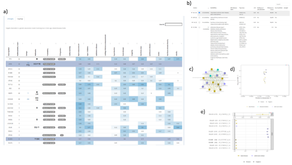

# TargetAgeApp

This repo contains the R Shiny web application to facilitate the exploration of the annotations of the TargetAge set of 995 targets with shared genetic links to age-related diseases and traits described in West et al., Integrative analysis of GWAS and co-localisation data suggests novel genes associated with age-related multimorbidity, medRxiv 2022.11.11.22282236 (https://doi.org/10.1101/2022.11.11.22282236).

Each target is annotated with the strength of the genetic link to each age-related trait (the Open Targets genetic association score), known links to ageing (GenAge, CellAge, and Hallmarks of Ageing), as well as the clinical precedence, tractability assessment, and known safety flags. The results can be filtered for specific genes, age-related traits, or Hallmarks of Ageing. In addition, individual genetic association clusters can be visualised and explored. Information on each study and locus in the cluster is presented, including the trait studied, sample size, effect size, most likely causal gene and L2G score. For cluster visualisation in TargetAge, nodes with summary statistics are highlighted with a black outline, edges supported by co-localisation are indicated with a thick black line, and pairs of nodes that share LD-defined tag variants but are not likely to share a causal variant according to co-localisation analysis are indicated with a dashed line. 

Fig 1) a) The list of TargetAge genes is shown within the TargetAge application, along with the strength of the genetic link to each age-related trait, known links to ageing or the Hallmarks of Ageing, predicted tractability, and available chemical probes or TEPs. b) Details of all multimorbidity clusters are shown, including the number of communities, the most likely causal genes, and information about the GWAS studies and lead variants associated with the cluster. c) A selected cluster can be explored using a network visualisation. d) The genomic positions and significance of lead variants associated with a cluster. e) The effect size (beta coefficient or odds ratio) of each lead variant, along with the L2G score for the most likely causal gene.  